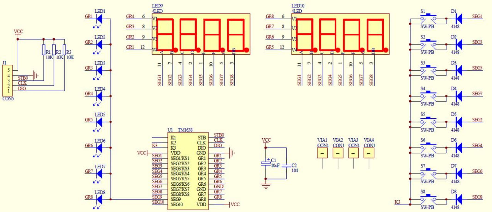

[Vietnamese version here!](./README_VI.md)

# VERILOG_tm1638_leds_and_keys

Interfacing with the Led&Key module via the TM1638 IC

## I. Author

- **Name:** Võ Nhật Trường
- **Email:** truong92cdv@gmail.com
- **GitHub:** [truong92cdv](https://github.com/truong92cdv)

## II. Demo Results

https://github.com/user-attachments/assets/b7c5aba8-a250-43e0-b88c-ab4844460aa1

- The 7-segment LED simulates a time counter in the **hh-mm-ss** format.
- The 8 LEDs in the top row have left and right shifting effects.
- Pressing the buttons will turn off the corresponding 7-segment LED display.

## III. Hardware

- ZUBoard 1CG model XCZU1CG-1SBVA484E
- Led&Key control module MDU1093 with integrated **TM1638** IC.
- Three signal lines: STB, CLK, DIO; power lines: VCC +5V and GND.

## IV. TM1638

Refer to the [TM1638 Datasheet](./refs/TM1638.PDF).

The TM1638 IC efficiently controls LEDs and scans keys using only three signal lines: STB, CLK, and DIO. Internally, the TM1638 has 16 8-bit registers, addressed from 00h to 0Fh.

There are three communication modes with TM1638:
1. Data transmission with automatic address increment.
2. Data transmission with a fixed address.
3. Reading key scan data.

The required data transmission frames are as follows:

Data is written to the TM1638 via the DIO pin on the rising edge of the CLK signal, and data is read from the TM1638 on the falling edge of the CLK signal.

Connection diagram of the [Led&Key TM1638 module](./refs/TM1638_schematic.pdf):

## V. Source Code

### [1. clk_divider](./src/clk_divider.v)

- Generates a 1 Hz (1s) clock from the 100 MHz clock of ZUBoard.

### [2. digits](./src/digits.v)

- Displays 8 digits on the 7-segment LED in **hh-mm-ss** format. The counter increments on each rising edge of the 1Hz clock (1s).

### [3. bcd_to_led7seg](./src/bcd_to_led7seg.v)

- The 7-segment LED in this project is of the common cathode type. The input is a 4-bit BCD digit, and the output is an 8-bit encoded signal for the LED segments DP, G, F, E, D, C, B, A.

### [4. tm1638](./src/tm1638.v)

This module creates the data transmission and reception frames for communication with TM1638. The **rw** flag indicates whether data is being sent or received.

The output CLK signal has a period of T(CLK) = 2^7 * 10 ns = 1.28 µs.

[Testbench code](./tb/tm1638_tb.v)

Waveform of tm1638_tb

### [5. top](./src/top.v)

The data transmission and reception process in the top module occurs as follows:
1. Send command 0x42 to indicate readiness to receive key scan data.
2. TM1638 sends 4 bytes of data. Decode to determine which key was pressed.
3. Send command 0x40 to indicate readiness to transmit data, with automatic address increment mode.
4. Send command 0xc0 to specify that the first register address is 00h.
5. Send 16 bytes of data to write to the internal registers of TM1638, controlling the LEDs.
6. Send command 0x8f to set the maximum display brightness.

[Testbench code](./tb/top_tb.v)

Waveform of top_tb

## VI. References

1. [TM1638 Datasheet](./refs/TM1638.PDF)
2. [Module Led&Key TM1638 schematic](./refs/TM1638_schematic.pdf)
3. [TM1638 project - alangarf](https://github.com/alangarf/tm1638-verilog)
