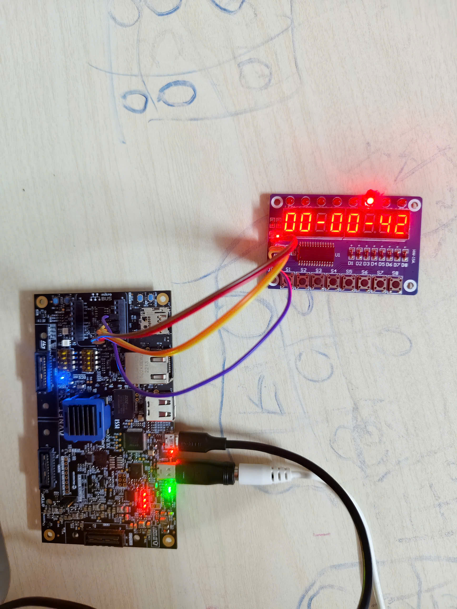
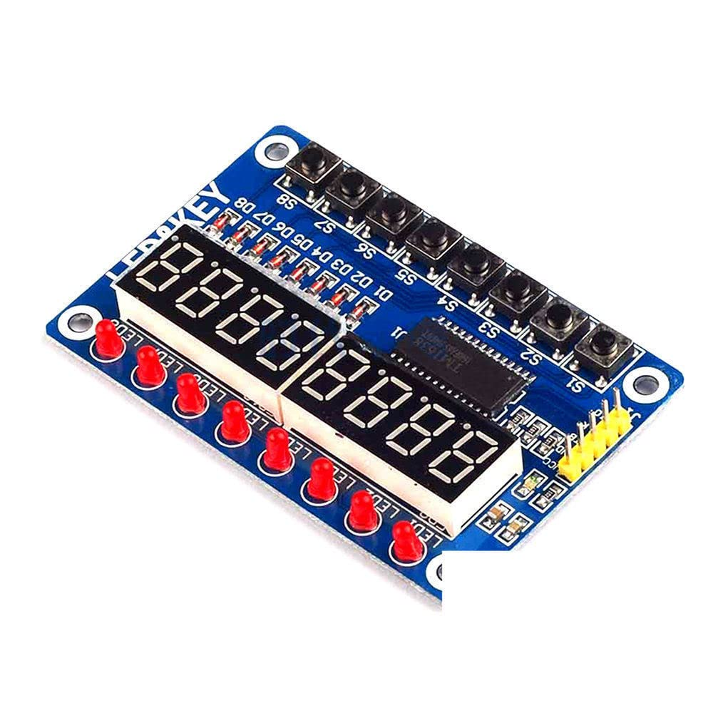

# VERILOG_tm1638_leds_and_keys

Giao tiếp với module Leds and Keys qua ic TM1638

## I. Tác giả

- **Name:** Võ Nhật Trường
- **Email:** truong92cdv@gmail.com
- **GitHub:** [truong92cdv](https://github.com/truong92cdv)

## II. Kết quả demo

## III. Thiết bị

- ZUBoard 1CG mã XCZU1CG-1SBVA484E
- Module điều khiển Leds and Keys MDU1093 tích hợp ic **TM1638**.
- 3 đường dây tín hiệu STB, CLK, DIO, dây VCC +5V, dây GND.

## VI. Tham khảo

1. [TM1638 Datasheet](./refs/TM1638.PDF)
2. [TM1638 module schematic](./refs/TM1638_shcematic.pdf)
3. [TM1638 project - alangarf](https://github.com/alangarf/tm1638-verilog)
