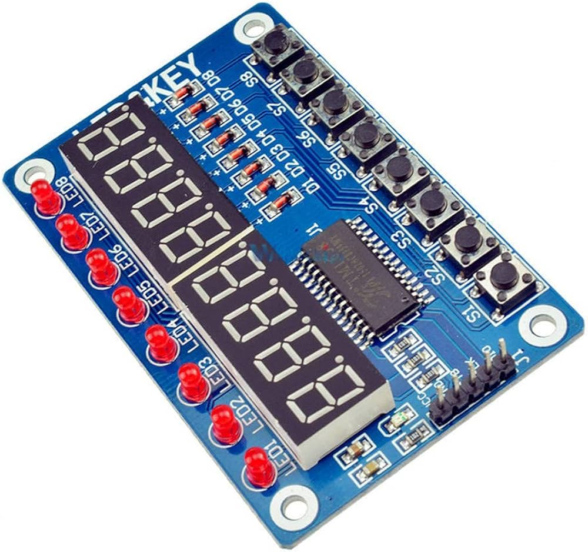
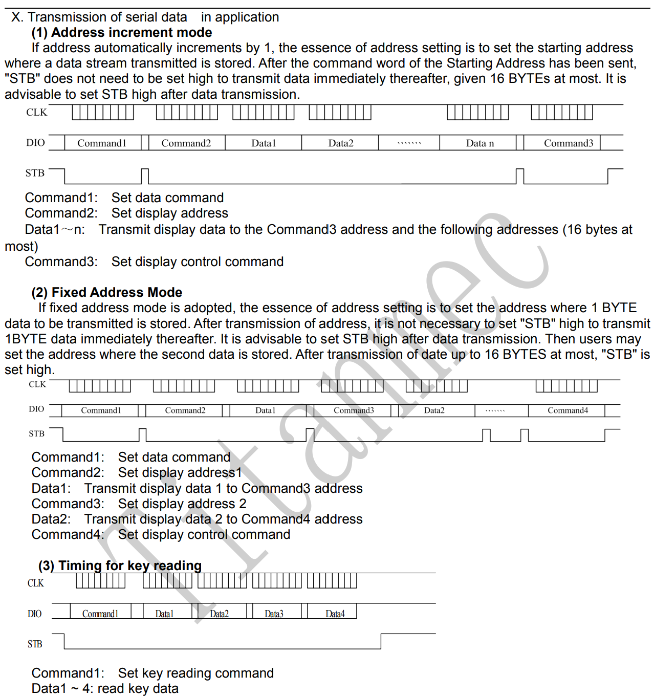
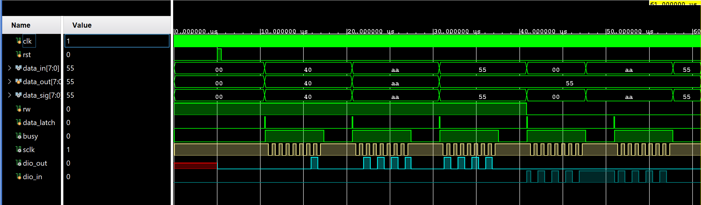
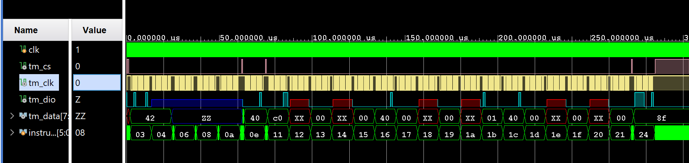

# VERILOG_tm1638_leds_and_keys

Giao tiếp với module Led&Key qua ic TM1638

## I. Tác giả

- **Name:** Võ Nhật Trường
- **Email:** truong92cdv@gmail.com
- **GitHub:** [truong92cdv](https://github.com/truong92cdv)

## II. Kết quả demo

https://github.com/user-attachments/assets/b7c5aba8-a250-43e0-b88c-ab4844460aa1

## III. Thiết bị

- ZUBoard 1CG mã XCZU1CG-1SBVA484E
- Module điều khiển Led&Key MDU1093 tích hợp ic **TM1638**.
- 3 đường dây tín hiệu STB, CLK, DIO, dây VCC +5V, dây GND.

## IV. TM1638

Tham khảo [TM1638 Datasheet](./refs/TM1638.PDF).

ic TM1638 giúp điều khiển led và quét phím hiệu quả với chỉ 3 dây tín hiệu: STB, CLK, DIO. Bên trong TM1638 có sẵn 16 thanh ghi 8 bit đánh địa chỉ từ 00h -> 0Fh.

Có 3 chế độ giao tiếp với TM1638:
1. Truyền dữ liệu với địa chỉ tăng tự động.
2. Truyền dữ liệu với địa chỉ cố định.
3. Đọc dữ liệu quét phím.

Các khung truyền dữ liệu tương ứng cần đạt được như sau:

Dữ liệu được ghi vào TM1638 ở chân DIO tại mỗi cạnh lên xung CLK, dữ liệu từ TM1638 sẽ ghi vào DIO tại cạnh xuống xung CLK.

## V. Source code

### [1. clk_divider](./src/clk_divider.v)

- Tạo clk 1 Hz (1s) từ clk 100 MHz của ZUBoard.

### [2. digits](./src/digits.v)

- 8 chữ số trên led 7 đoạn theo định dạng **hh-mm-ss**. Bộ đếm tăng với mỗi cạnh lên xung clk 1Hz (1s).

### [3. bcd_to_led7seg](./src/bcd_to_led7seg.v)

- Led 7 đoạn trong bài thuộc loại common cathode, đầu vào là 1 chữ số BCD 4 bit, đầu ra là 8 bit mã hóa 8 đoạn led từ DP, G, F, E, D, C, B, A.

### [4. tm1638](./src/tm1638.v)

Module tạo khung truyền nhận dữ liệu giao tiếp với tm1638, cờ **rw** để báo hiệu truyền hay nhận dữ liệu.

Xung CLK đầu ra có chu kỳ T(CLK) = 2^7 * 10 ns = 1.28 us.

[Testbench code](./tb/tm1638_tb.v)

Waveform tm1638_tb

### [5. top](./src/top.v)

Tiến trình truyền nhận dữ liệu ở module top diễn ra gồm các bước
1. Gửi lệnh 0x42 báo hiệu chuẩn bị nhận dữ liệu quét phím.
2. TM1638 gửi 4 byte dữ liệu. Giải mã để xác định phím nào được nhấn.
3. Gửi lệnh 0x40 báo hiệu chuẩn bị truyền dữ liệu, chế độ địa chỉ tăng tự động.
4. Gửi lệnh 0xc0 thông báo địa chỉ thanh ghi đầu tiên là 00h.
5. Gửi 16 byte dữ liệu để ghi vào thanh ghi nội của TM1638, điều khiển đèn led.
6. Gửi lệnh 0x8f thiết lập độ sáng hiển thị tối đa.

[Testbench code](./tb/top.v)

Waveform top_tb

## VI. Tham khảo

1. [TM1638 Datasheet](./refs/TM1638.PDF)
2. [TM1638 module schematic](./refs/TM1638_shcematic.pdf)
3. [TM1638 project - alangarf](https://github.com/alangarf/tm1638-verilog)
